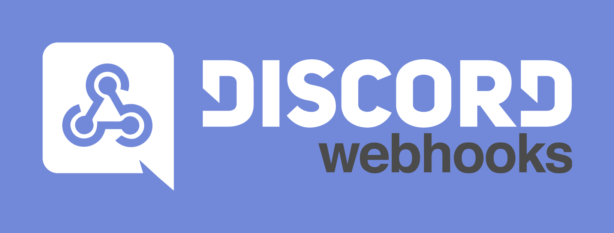

# discord-webhooks

## Содержание

* [Введение](https://darkpro1337.github.io/discord-webhooks/intro)
  * [JSON](https://darkpro1337.github.io/discord-webhooks/intro/json)
  * [Структура Вебхуков](https://darkpro1337.github.io/discord-webhooks/intro/discord-webhook)
* Интеграции с:
  * [IFTTT](https://darkpro1337.github.io/discord-webhooks/services/ifttt)
  * [IFTTT Platform](https://darkpro1337.github.io/discord-webhooks/services/ifttt-platform)
* Использование с:
  * [Postman](https://darkpro1337.github.io/discord-webhooks/tools/postman)
  * [HTTPie](https://darkpro1337.github.io/discord-webhooks/tools/httpie)
  * [cURL](https://darkpro1337.github.io/discord-webhooks/tools/curl)
* Примеры:
  * [Twitch](https://darkpro1337.github.io/discord-webhooks/examples/twitch)
  * [Spotify](https://darkpro1337.github.io/discord-webhooks/examples/spotify)
* Дополнительная информация
  * [Discord Markdown](https://darkpro1337.github.io/discord-webhooks/other/discord-markdown)
  * [Slack форматирование](https://darkpro1337.github.io/discord-webhooks/other/slack-formatting)
  * [Ограничения полей](https://darkpro1337.github.io/discord-webhooks/other/field-limits)

## Ссылки

* [IFTTT](https://ifttt.com/)
* [Postman](https://www.getpostman.com/)
* [cURL](https://curl.haxx.se/)
* [HTTPie](https://httpie.org/)
* [Zapier](https://zapier.com/)
* [Integromat](https://www.integromat.com/)
