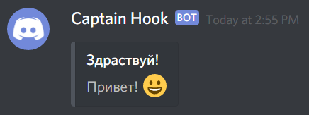
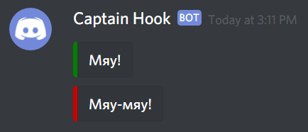

Добавляет сообщение с вложением. `embeds` это массив, который может содержать до 10 вложений в одном сообщении.

Пример:

```json
{
  "embeds": [{
    "title": "Здравствуй!",
    "description": "Привет! :grinning:"
  }]
}
```



```json
{
  "embeds": [
    {
      "title": "Мяу!",
      "color": 32768
    },
    {
      "title": "Мяу-мяу!",
      "color": 13369344
    }
  ]
}
```


